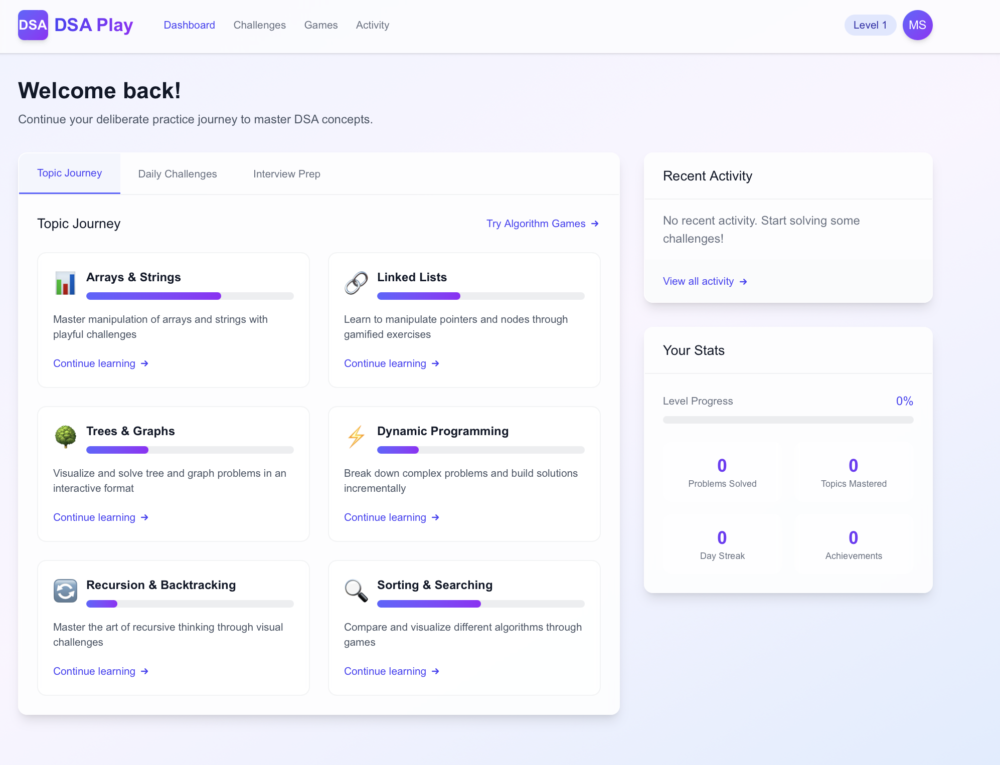
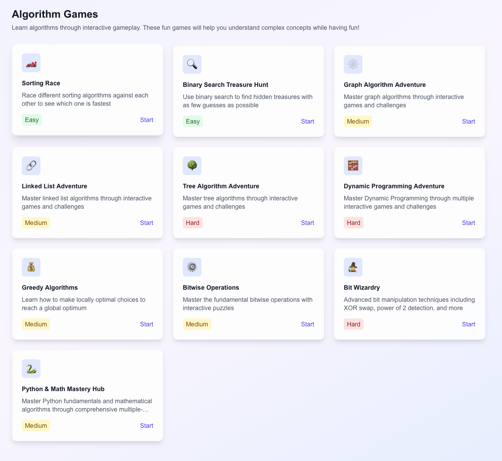
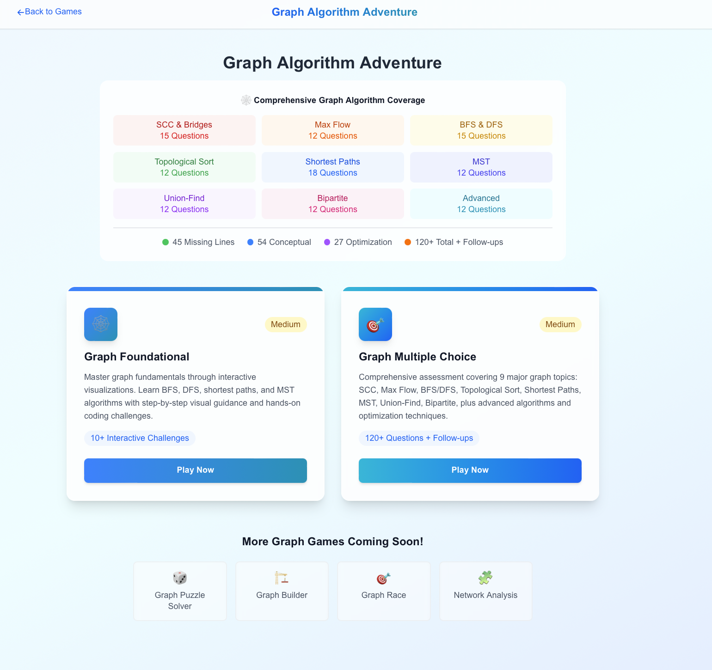

# DSA Deliberate Play

A gamified web application designed to help you master Data Structures and Algorithms through deliberate play principles.

## Screenshots

| Home | Games | Activity |
|------|-------|----------|
|  |  |  |

## About

DSA Deliberate Play transforms the often tedious process of practicing Data Structures and Algorithms into an engaging, motivating experience. By incorporating elements of deliberate play, this application helps you consolidate your knowledge more effectively and prepare for technical interviews at top tech companies.

## Features

- **Interactive Algorithm Visualizer**: Step through sorting, searching, graph traversal, and tree algorithms with real-time animations and synchronized Python code highlighting
- **Gamified Challenges**: Solve DSA problems through gamified interfaces with XP rewards and completion tracking
- **Multiple Game Modes**: Foundational challenges and multiple-choice questions for each topic
- **Python Code Walkthroughs**: Every algorithm game includes a side-by-side Python implementation panel with line-by-line highlighting
- **Progress Tracking**: Monitor your growth with XP, activity history, and achievement tracking
- **Dark Mode Support**: Full dark/light theme toggle across all pages

## Algorithm Games

| Game | Topic | Difficulty |
|------|-------|------------|
| Sorting Race | Quicksort, Partitioning | Easy |
| Binary Search Treasure Hunt | Binary Search | Easy |
| Graph Algorithm Adventure | BFS, DFS, SCC, Max Flow, MST, Shortest Paths | Medium |
| Linked List Adventure | Reversal, Merge, Cache Design, Pointer Manipulation | Medium |
| Tree Algorithm Adventure | Inorder, Preorder, Postorder, BST, Tree DP, LCA | Hard |
| Dynamic Programming Adventure | Fibonacci, Knapsack, LCS | Hard |
| Greedy Algorithms | Activity Selection, Fractional Knapsack, Huffman Coding | Medium |
| Bitwise Operations | AND, OR, XOR, NOT, Shift | Medium |
| Bit Wizardry | XOR Swap, Power of 2 Check, Isolate Rightmost Bit | Hard |
| Python & Math Mastery Hub | Lambda, Collections, Modulo, Binary Exponentiation | Medium |

## Getting Started

### Prerequisites

- Node.js (18.x or later)
- npm or yarn

### Installation

1. Clone the repository:
   ```bash
   git clone https://github.com/yourusername/dsa-deliberate-play.git
   cd dsa-deliberate-play
   ```

2. Install dependencies:
   ```bash
   npm install
   ```

3. Start the development server:
   ```bash
   npm run dev
   ```

4. Open [http://localhost:3000](http://localhost:3000) in your browser.

## Project Structure

```
src/app/
├── page.tsx                          # Landing page
├── layout.tsx                        # Root layout
├── dashboard/page.tsx                # Dashboard
├── profile/page.tsx                  # User profile & achievements
├── activity/page.tsx                 # Activity history & XP log
├── topics/[topicId]/page.tsx         # Topic detail pages
├── challenges/[challengeId]/page.tsx # Individual challenges
├── games/
│   ├── page.tsx                      # Games hub with visualizer & code panel
│   ├── graph-adventure/              # Graph algorithms (foundational + MCQ)
│   ├── linked-list-adventure/        # Linked list algorithms (foundational + MCQ)
│   ├── tree-adventure/               # Tree algorithms (foundational + MCQ)
│   ├── dynamic-programming-adventure/# DP algorithms (foundational + MCQ)
│   ├── bitwise-operations/           # Bitwise fundamentals
│   ├── bit-wizardry/                 # Advanced bit manipulation
│   └── python-math-hub/              # Python & math MCQs
├── components/
│   ├── AlgorithmVisualizer.tsx       # Core visualizer for all algorithm types
│   ├── GameCard.tsx                  # Reusable game selection card
│   ├── NavLinks.tsx                  # Navigation links
│   ├── CodeEditor.tsx                # Interactive code editor
│   ├── PyodideLoader.tsx             # Python runtime loader
│   └── DataInitializer.tsx           # Data initialization component
└── utils/
    └── storage.ts                    # XP, activity history, localStorage utilities
```

## Technologies Used

- **Next.js 15** with Turbopack
- **React 19**
- **TypeScript**
- **Tailwind CSS 4**
- **Radix UI** (Progress, Tabs)
- **react-syntax-highlighter** (Python code panel)
- **Lucide React** (Icons)

## Deliberate Play Principles

This application is built on the concept of deliberate play, which:

- Makes learning enjoyable while still being effective
- Incorporates game-like elements (XP, achievements) to maintain motivation
- Provides immediate visual feedback for faster learning
- Creates varied challenges to develop flexible problem-solving skills
- Balances structured learning with creative exploration

## License

This project is licensed under the MIT License - see the LICENSE file for details.